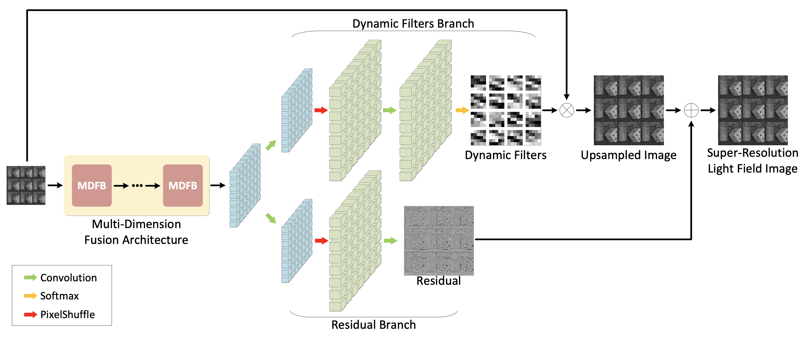

# Multi-Dimension Fusion Network for Light Field Spatial Super-Resolution using Dynamic Filters

[Arxiv](https://arxiv.org/abs/2008.11449)

## Introduction

Light field cameras have been proved to be powerful tools for 3D reconstruction and virtual reality applications. However, the limited resolution of light field images brings a lot of difficulties for further information display and extraction. In this paper, we introduce a novel learning-based framework to improve the spatial resolution of light fields. First, features from different dimensions are parallelly extracted and fused together in our multi-dimension fusion architecture. These features are then used to generate dynamic filters, which extract subpixel information from micro-lens images and also implicitly consider the disparity information. Finally, more high-frequency details learned in the residual branch are added to the upsampled images and the final super-resolved light fields are obtained. Experimental results show that the proposed method uses fewer parameters but achieves better performances than other state-of-the-art methods in various kinds of datasets. Our reconstructed images also show sharp details and distinct lines in both sub-aperture images and epipolar plane images.

<div align="center">




</div>

## Getting Started

1. Install requirements

```bash
pip install -r requirements.txt
```

2. Write down your configuration for this experiment. All missing parameters will find in default configuration. Thus, if you add some new parameters, add them in *default.py* to make sure previous experiments can also run.
3. Use following command to start trainer.

```bash
python3 main.py -c your_config
```

## Structure

- config: Default configuration and experiment configurations.
- data: Data preprocess and datasets.
- engine: Codebase.
- loss: Loss functions.
- model: Network functions.
- trained_models: Trained model_state_dict.
